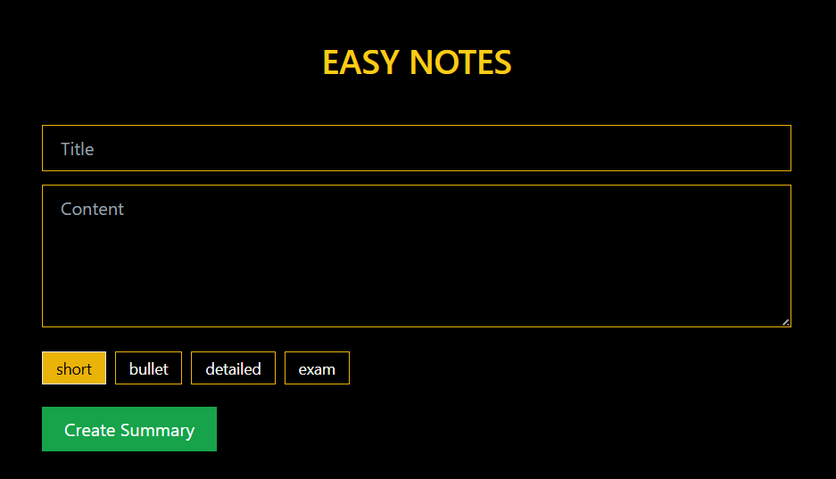
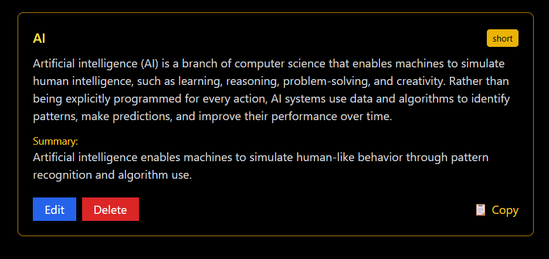
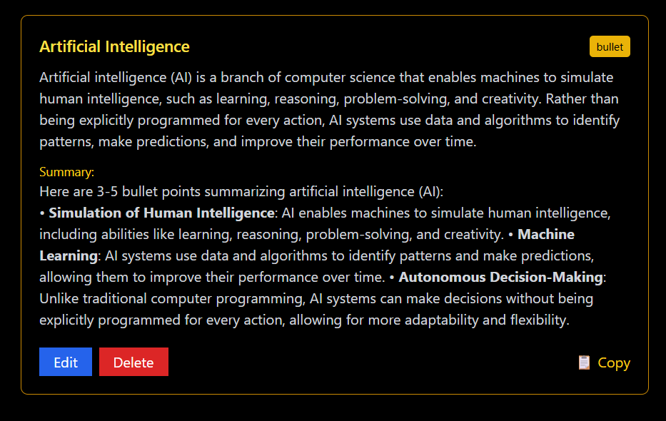
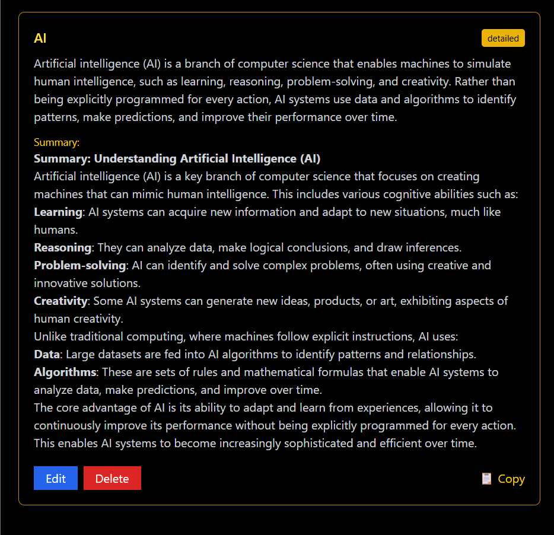
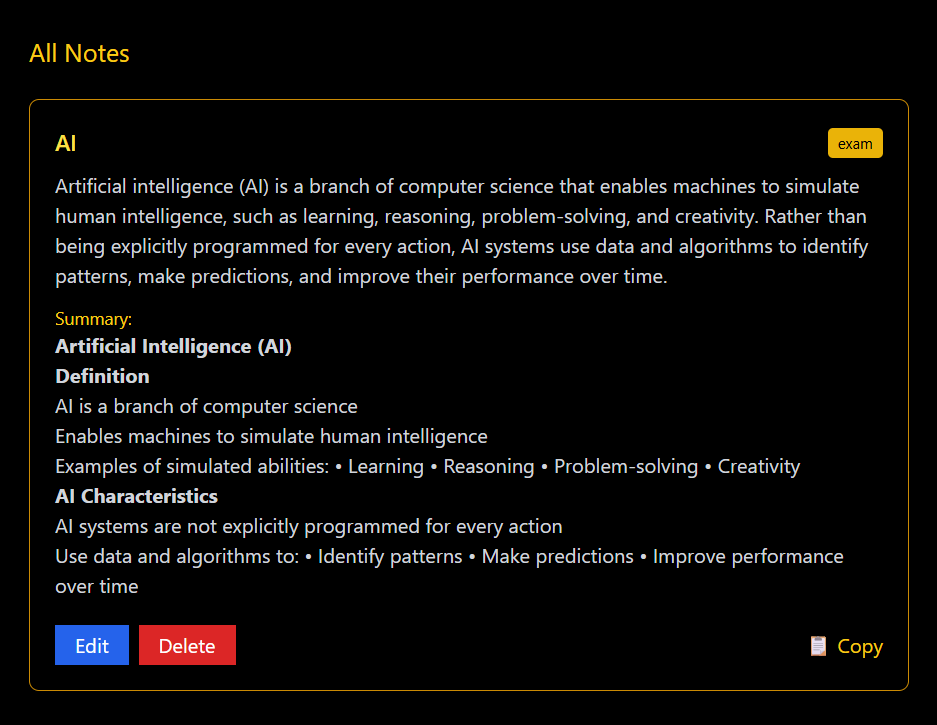

# 📝 Easy Notes

[](https://reactjs.org/)
[](https://expressjs.com/)
[](https://www.mongodb.com/)
[](https://tailwindcss.com/)
[](https://groq.com/)

> A modern, full-stack note-taking application powered by AI for intelligent summarization. Transform your notes into concise, actionable insights with multiple summary modes.

## ✨ Features

- 🚀 **AI-Powered Summarization**: Leverage Groq's advanced AI to generate intelligent summaries
- 📝 **Multiple Summary Modes**: Choose from `short`, `bullet`, `detailed`, or `exam` formats
- 🎨 **Beautiful UI**: Modern React interface with Tailwind CSS styling
- 📋 **One-Click Copy**: Easily copy summaries to clipboard
- 🔄 **Real-time Updates**: Create, edit, and delete notes seamlessly
- 📱 **Responsive Design**: Works perfectly on desktop and mobile devices
- 🔔 **Toast Notifications**: User-friendly feedback for all actions
- 📊 **Markdown Rendering**: Rich text display with GitHub Flavored Markdown support

## 📸 Screenshots

### Initial Interface

*The clean, intuitive interface for creating and managing notes*

### Summary Formats

#### Short Summary

*Concise overview of your notes*

#### Bullet Points Summary

*Structured bullet-point format for quick scanning*

#### Detailed Summary

*Comprehensive analysis with full context*

#### Exam-Style Summary

*Structured format perfect for study and review*

## 🏗️ Architecture

```
easy-notes/
├── client/          # React frontend application
│   ├── src/
│   │   ├── App.js   # Main application component
│   │   └── ...
│   ├── public/      # Static assets
│   └── package.json
├── server/          # Express.js backend API
│   ├── models/      # MongoDB schemas
│   ├── routes/      # API endpoints
│   ├── controllers/ # Business logic
│   ├── utils/       # AI summarization utilities
│   └── server.js    # Main server file
└── README.md
```

## 🚀 Quick Start

### Prerequisites

- Node.js (v16 or higher)
- MongoDB Atlas account (or local MongoDB)
- Groq API key

### Installation

1. **Clone the repository**
   ```bash
   git clone <https://github.com/singham07/easy-notes>
   cd easy-notes
   ```

2. **Install dependencies**
   ```bash
   # Install server dependencies
   cd server
   npm install

   # Install client dependencies
   cd ../client
   npm install
   ```

3. **Environment Setup**
   ```bash
   cd ../server
   cp .env.example .env
   ```

   Update `server/.env` with your configuration:
   ```env
   MONGO_URI=your_mongodb_connection_string
   PORT=5000
   GROQ_API_KEY=your_groq_api_key
   ```

4. **Start the application**
   ```bash
   # Start the server (in one terminal)
   cd server
   npm run dev

   # Start the client (in another terminal)
   cd ../client
   npm start
   ```

5. **Open your browser**

   Navigate to [http://localhost:3000](http://localhost:3000) to start taking notes!

## 🔧 API Reference

### Endpoints

| Method | Endpoint | Description |
|--------|----------|-------------|
| GET | `/api/notes` | Retrieve all notes |
| POST | `/api/notes/create` | Create a new note |
| PUT | `/api/notes/:id` | Update an existing note |
| DELETE | `/api/notes/:id` | Delete a note |
| POST | `/api/notes/:id/summarize` | Regenerate note summary |

### Request/Response Examples

**Create Note**
```json
POST /api/notes/create
{
  "title": "Meeting Notes",
  "content": "Discussed project timeline and deliverables...",
  "mode": "bullet"
}
```

**Response**
```json
{
  "success": true,
  "note": {
    "_id": "...",
    "title": "Meeting Notes",
    "content": "...",
    "summary": "- Discussed project timeline\n- Reviewed deliverables...",
    "mode": "bullet",
    "createdAt": "2024-01-01T00:00:00.000Z"
  }
}
```

## 🛠️ Technologies Used

- **Frontend**: React 19, Tailwind CSS, React Markdown, React Toastify
- **Backend**: Node.js, Express.js, MongoDB with Mongoose
- **AI**: Groq API for text summarization
- **Development**: Nodemon, Create React App

## 📁 Project Structure Details

### Client (`/client`)
- Modern React application with hooks
- Tailwind CSS for responsive styling
- Markdown rendering with GitHub Flavored Markdown
- Toast notifications for user feedback
- Clipboard API integration

### Server (`/server`)
- RESTful API built with Express.js
- MongoDB integration with Mongoose ODM
- AI-powered summarization using Groq
- CORS enabled for cross-origin requests
- Environment-based configuration

## 🤝 Contributing

We welcome contributions! Please follow these steps:

1. Fork the repository
2. Create a feature branch (`git checkout -b feature/amazing-feature`)
3. Commit your changes (`git commit -m 'Add amazing feature'`)
4. Push to the branch (`git push origin feature/amazing-feature`)
5. Open a Pull Request

## 📝 Future Enhancements

- [ ] User authentication and authorization
- [ ] Note categories and tags
- [ ] Search functionality
- [ ] Dark mode toggle
- [ ] Export notes to PDF/Markdown
- [ ] Collaborative note editing
- [ ] Mobile app version

## 📄 License

This project is licensed under the MIT License - see the [LICENSE](LICENSE) file for details.

## 🙏 Acknowledgments

- [Groq](https://groq.com/) for providing fast AI inference
- [MongoDB Atlas](https://www.mongodb.com/atlas) for database hosting
- [Tailwind CSS](https://tailwindcss.com/) for beautiful styling
- [React](https://reactjs.org/) for the amazing frontend framework

---

**Made with ❤️ for productivity enthusiasts**
